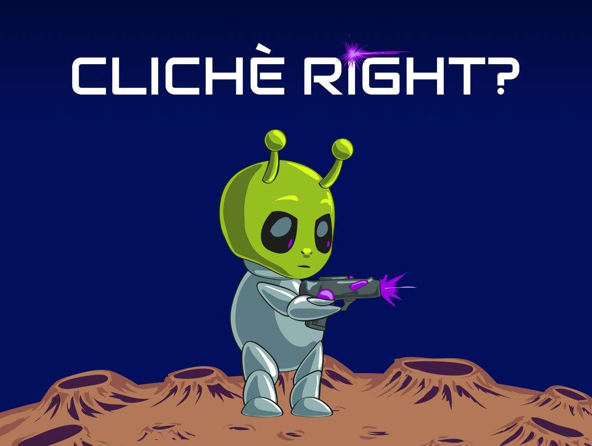

# Cliche, right?

	

	
Our take on the "cliche" theme revolves around the iconic catchphrase of this character, SCP-2020. In the shape of an alien, this "entity" wishes to be a scifi novel writer, and always comes up with some cliche story plots.

In this game, each story is a playable minigame (at the moment for a total of 2 _to be expanded, maybe_) which, if completed, will give you points up to an amount of 100 every time. The game goes on, with increasing difficult, until you fail.

Your total score will be the sum of your partial scores.

Have fun <3

	

	

## Play

Try it on [itch.io](https://gcoro.itch.io/cliche-right)

## About SCPs

[What is SCP? 🤔](https://en.wikipedia.org/wiki/SCP_Foundation)

SCPs we referenced in the game: 

- [SCP-173](https://scp-wiki.wikidot.com/scp-173) a monster that can instantly kill you when anyone stops making eye contact with it;
- [SCP-5153](https://scp-wiki.wikidot.com/scp-5153) / [SCP-2000](https://scp-wiki.wikidot.com/scp-2000) an indestructible asteroid that is gonna impact the earth, and the base that humanity needs to build before it's too late;
- [SCP-2020](https://scp-wiki.wikidot.com/scp-2020), a sapient humanoid entity who wants to write sci-fi novels.

## Team

- Game development > gcoro , wiulma, ale958, trexy94, nadenadenade
- Game design > Alessandro Marani 
- Original menu graphics > Giulia Garulli 

## Assets credits

### Audio & Music

-   [door locked](https://freesound.org/people/BenjaminNelan/sounds/321087/)
-   [door opening](https://opengameart.org/content/door-open-sfx)
-   [main scene theme](https://opengameart.org/content/green-gray)
-   [meteor theme](https://opengameart.org/content/meteor-1)
-   [cleaning theme](https://opengameart.org/content/floor-34-clean-and-dirty-area)
-   [game over theme](https://opengameart.org/content/music-box-game-over-ii)
-   [stone](https://freesound.org/people/thanvannispen/sounds/29986/)
-   [monster scream](https://freesound.org/people/ibm5155/sounds/174912/)
-   [explosion](https://freesound.org/people/Iwiploppenisse/sounds/156031/)
-   [level complete](https://freesound.org/people/deleteCookies/sounds/376009/)
-   [speaking](https://freesound.org/people/SomeGuy22/sounds/431328/)
-   [shoot](https://freesound.org/people/Aesterial-Arts/sounds/633250/)
-   [blood clean](https://freesound.org/people/magnuswaker/sounds/563315/)
-   [hit](https://opengameart.org/content/hit-sound-effects)
-   [win](https://opengameart.org/content/win-sound-effect)

### Main Scene

-   [bg](https://opengameart.org/content/sideview-sci-fi-patreon-collection)
-   [doors](https://opengameart.org/content/lab-textures)
-   [alien](https://craftpix.net/freebies/2d-game-alien-character-free-sprite/)

### SCP-173

-   [poops](https://www.gamedeveloperstudio.com/graphics/viewgraphic.php?page-name=poop-game-sprites&item=1g6v4g0e1k7m7b5411)
-   [blood and bones](https://psychronic.com/abusive-prison-tileset/)
-   [alien sprite](https://kenney.nl/assets)
-   [alien guards](https://secrethideout.itch.io/team-wars-platformer-battle)
-   [eye monster](https://kuuly.itch.io/covid-boss)
-   [cursor](https://opengameart.org/content/%E2%80%9Calien%E2%80%9D-crosshairs)
-   [tiles](https://foozlecc.itch.io/sci-fi-lab-tileset-decor-traps)

### SCP-5153

-   [background](https://pxhere.com/it/photo/1460581)
-   [guns](https://twitter.com/hashashaaaa)
-   [asteroid](https://opengameart.org/content/2d-asteroid-sprite)
-   [meteor](https://weisinx7.itch.io/fireballs-sprites)
-   [explosion effects](https://weisinx7.itch.io/fireball-explosion-sprites)
-   [tiles](https://foozlecc.itch.io/sci-fi-lab-tileset-decor-traps)
-   [tiles](https://helperwesley.itch.io/helpers-artpack)
